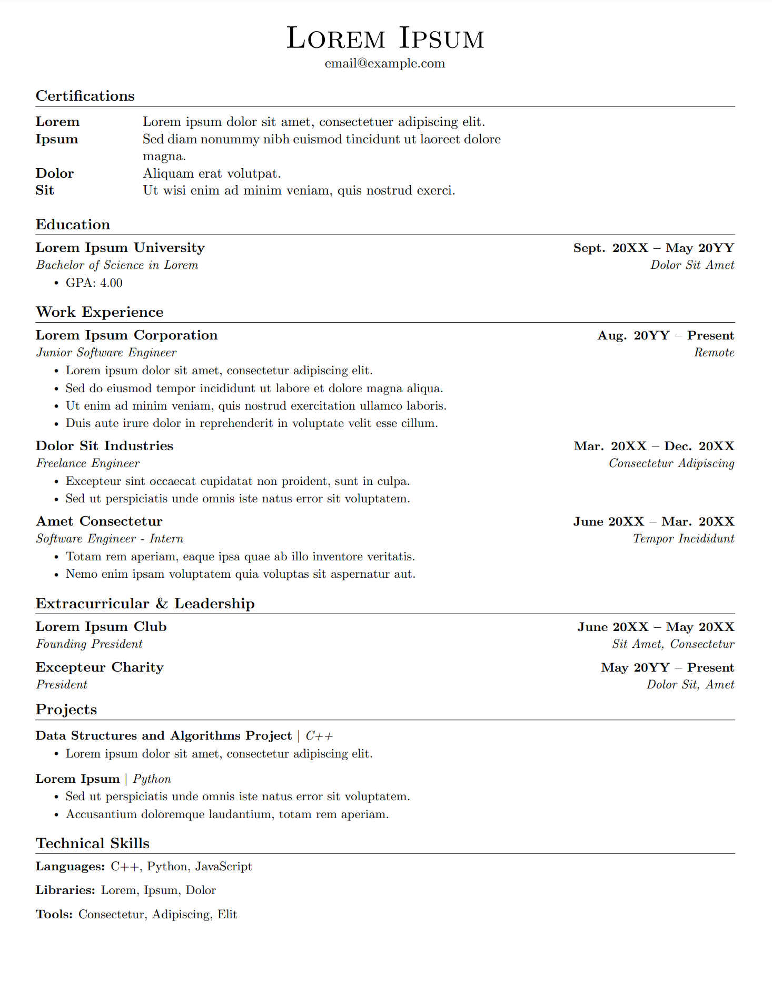

# LaTeX Resume Template

This repository contains a customizable LaTeX resume template. It’s designed to work natively on Overleaf (or any standard LaTeX distribution) with minimal dependencies. Use this template however you would like. Good luck on the job hunt!

## Overview

This resume template includes customizable sections for Certifications, Education, Work Experience, Extracurricular & Leadership, Projects, and Technical Skills.
It comes with commented sections for font choices (serif, sans serif, and monospace) so you can easily toggle between styles.

## Getting Started

1. **Clone or Download the Repository:**
   Clone this repository to your local machine or open it directly in Overleaf.

2. **Edit the Template:**
   Open the main `.tex` file and replace the placeholder text (e.g., "Lorem Ipsum") with your personal data.
   Uncomment and adjust font options in the preamble if desired.

3. **Compile the Document:**
   Use `pdflatex` or Overleaf to compile the document and produce the PDF output.

## Customization

- **Font Options:**
  In the preamble, there are multiple font choices commented out for serif, sans serif, and monospace styles.
  Simply remove the percent sign (`%`) from the line corresponding to your preferred option.

- **Sections and Content:**
  Edit sections like Certifications, Education, Work Experience, etc. according to your needs.
  Use the provided custom commands (e.g., `\resumeSubheading`, `\resumeItem`) to maintain the formatting.

## Screenshots

  

## Contributing

Contributions to this template are welcome! If you encounter any issues or have suggestions, please open an issue or submit a pull request.

## License

This project is licensed under the MIT License.
